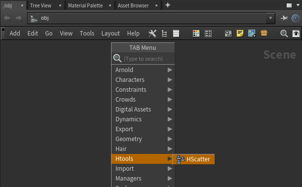
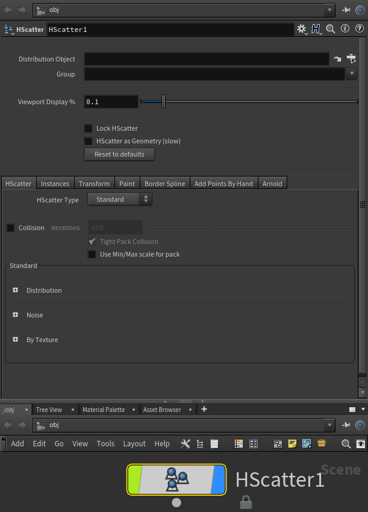

# HScatter

Houdini OBJ asset for scatter large amounts of geometry instances. Currently it supports Mantra and Arnold

- Scatters large amounts of geometry
- Instance or Geometry mode
- Scatters by surface, texture, curve, border curve, pattern, on particles or in volume
- Various visual instance reperesetation
- Transform, color randomization
- Paint distribution, scale or color
- Border spline
- Collision detection
- Adds instances in certain places by hand

If you spot any bugs, please feel free to send me an email at gammany@gmail.com

How to Install:

Copy 'ApplyInstances.hda' and 'HScatter.hda' into your scanned assets directory $HOME/houdini/otls

Help:

Coming soon
